# Companion for MaxPV!

"Companion" est un écran déporté et autonome pour l'affichage des informations du routeur solaire MaxPV!

L'afficheur utilise un simple et discret LILYGO T-Display S3 qui se connecte à votre réseau local. Il n'est donc pas nécessaire d'avoir une installation domotique pour fonctionner.
L'afficheur est alimenté soit avec un chargeur de téléphone (port USB-C à privilégier), soit une batterie à rajouter.
 De taille réduire, dimensions : 7x3 cm (écran 1,9 pouces), il peut se déplacer facilement.

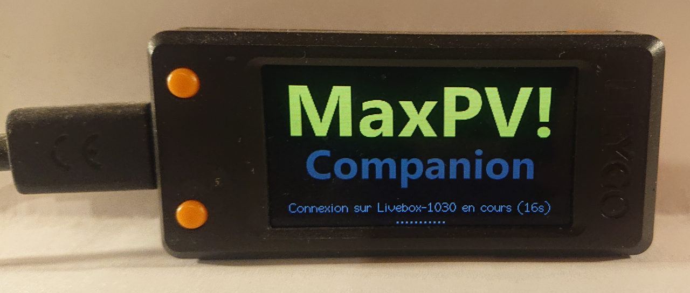

Les données affichées sont les suivantes : 
- production photovoltaiques, 
- énergie routée vers le cumulus, 
- la consommation électrique du domicile, 
- la quantité d'énergie exportée,
- la réserve d'énergie,
- les informations météo locales,
- l'heure et la date locale,
- l'heure du lever et du coucher de soleil,
- synthèse quotidienne,
  
Ainsi que les fonctionnalités suivantes :
- mise en veille programmable et réactivation automatique,
- puissance du réseau wifi,
- fonction serveur permettant de lire les données dans un navigateur
  
En option :
- température du cumulus, si vous avez une sonde connectée au réseau local.

Les données sont réactualisées toutes les 10 secondes. 

## Liens
Forum d'échange sur Companion : https://forum-photovoltaique.fr/viewtopic.php?f=110&t=62730

Repository de `MaxPV!` :  https://github.com/Jetblack31/MaxPV

# Installation
## Plateforme Arduino IDE
Pour l'installation de la plateforme, se référer au manuel `Installation.pdf` disponible à l'adresse https://github.com/JJHontebeyrie/Companion/blob/main/Installation.pdf (utiliser le bouton "Download" si le document ne s'affiche pas directement).

De nombreuses bibliothèques sont à installer dans le répertoire `librairies`.

## Téléchargement des sources de "Companion"
Depuis cette page Github, vous pouvez télécharger les sources de 2 façons selon le cas qui vous intéresse. La première me semble la plus adaptée.

1. Depuis le tag de la version qui vous intéresse : permet de récupérer uniquement les sources de la  version concernée
   
	Cliquer sur le lien "tag" :
	

	Puis sur le lien "Zip" de la version qui vous intéresse :
	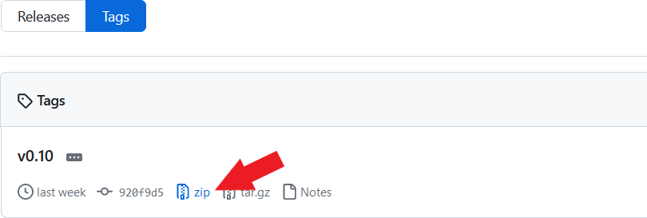

	Cette action téléchargera un fichier avec le numéro de la version (par exemple : `Companion_for_MaxPV-1.0.zip`) sur votre poste, qui contient un sous-répertoire "Companion" avec les sources.
	Cette méthode est pratique si l'on veut conserver des versions séparées dans le répertoire des croquis d'ArduinoIDE.

2. Depuis la page principale : télécharge la dernière version des sources.
Cliquez sur le bouton vert `<> Code`, puis sur `Download ZIP`.

	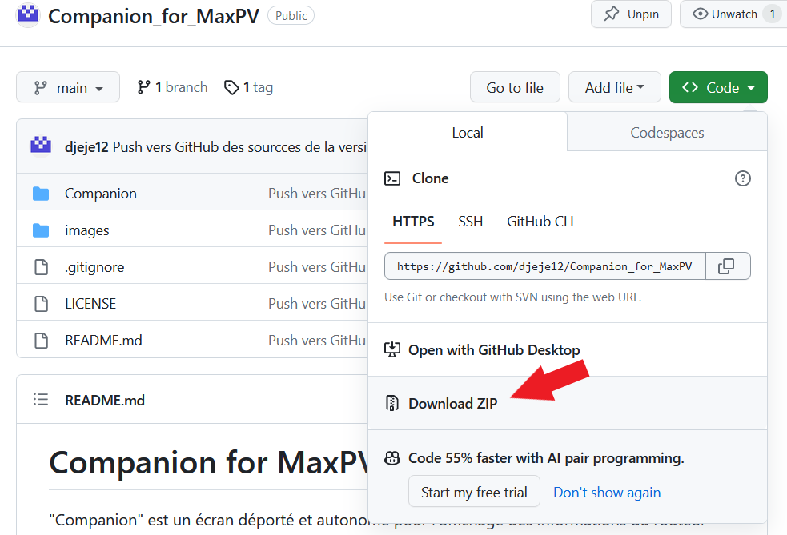   

	Cette action téléchargera un fichier `Companion_for_MaxPV-main.zip` sur votre poste, qui contient un sous-répertoire "Companion" avec les sources.

## Installation des sources de "Companion" dans ArduinoIDE
Décompresser l'archive ZIP de Companion dans le répertoire des croquis d'ArduinoIDE.
Par exemple dans `D:\Documents\Arduino\` vous devez avoir une arborescence de répertoires du type : 
 - `D:\Documents\Arduino\Companion_for_MaxPV-1.0\Companion\`
dans laquelle se trouvent les fichiers `Companion.ino` et les autres fichiers `.h` 
 
Depuis l'Arduino IDE, ouvrir "**Fichier > Carnet de croquis > Companion_for_MaxPV-1.0 > Companion**".

Modifier le fichier `perso.h` avec vos paramètres locaux. Chaque paramètre est documenté en commentaire dans le fichier.

## Installation du "Companion" sur le "LilyGo S3"
Branchez la carte `LilyGo T-Display-S3` avec un cable USB à votre PC.

Sélectionnez la carte `LilyGo T-Display-S3` et le port associé. Le nom de la carte apparait alors en gras.

S'assurer que **"Outils > USB CDC On Boot"** est à **"Disabled"**. Car sinon le démarrage de la carte ne sera pas possible en autonome, ni tant que l'écran "Moniteur série" n'est pas ouvert dans ArduinoIDE... Et la carte reste bloquée sur l'écran d'accueil...

Pour information, voici les paramètres sélectionnés dans le menu `Outils` d'ArduinoIDE :

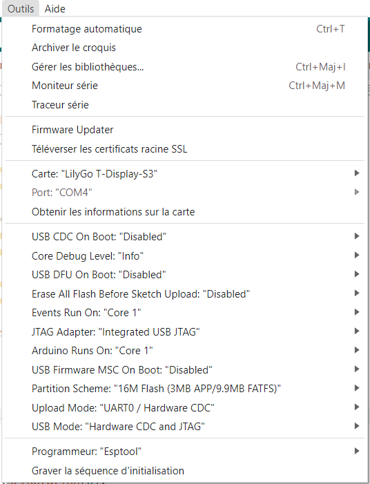

Lancer le téléversement avec le 2ème bouton ci-dessous:

L'opération de compilation dure environ 1 min car il y a pas mal de bibliothèques à compiler...

L'installation se termine avec les messages `Writing 100%` et `Hard reseting`

# Guide d'utilisation

## Ecran principal

L'écran est une synthèse des données les plus importantes fournies par MaxPV! agrémentées de données météo.

Un indicateur dans le coin supérieur gauche vous averti de la fraicheur des données. Il faut attendre que le point vert disparaisse pour changer d'écran.

Lorsqu'il n'y a pas de production PV, alors les heures de coucher et lever du soleil sont affichées.

Des jauges colorées à droite des valeurs de production PV, du routage de l'eau chaude sanitaire (ECS) ou de la consommation, permettent de visualiser le niveau actuel par rapport au niveau maximum admis. 

Code des couleurs : 
- rouge : pas bon
- vert : bon

La consommation réseau passe à `Injection réseau` si de l'énergie est envoyée vers le réseau. La jauge devient alors blanche et évalue la quantité "perdue" par rapport à la quantité produite. Par exemple, si elle est pleine et blanche, alors toute la production est injectée sur le réseau!

Le bouton rond coloré à droite "réserve d'énergie" affiche la valeur de l'énergie disponible (en kW) avant de devoir consommer sur le réseau. Il permet de visualiser rapidement si vous pouvez lancer un appareil énergivore sans crainte (aspirateur, chauffage, etc...)

Les couleurs indicatrices sont :
- rouge : consommation réseau, pas de réserve d'énergie,
- orange : réserve d'énergie faible (moins de 200W),
- jaune : réserve d'énergie moyenne (moins de 1000W),
- vert : reserve d'énergie importante (jusqu'à 2000W),
- bleu turquoise : réserve d'énergie très importante (plus de 2000W).

L'indicateur wifi vous prévient de la qualité de la connexion. Si la connexion est mauvaise et que la récupération des données prend trop de temps, l'afficheur risque de redémarrer automatiquement au bout de 20 secondes.

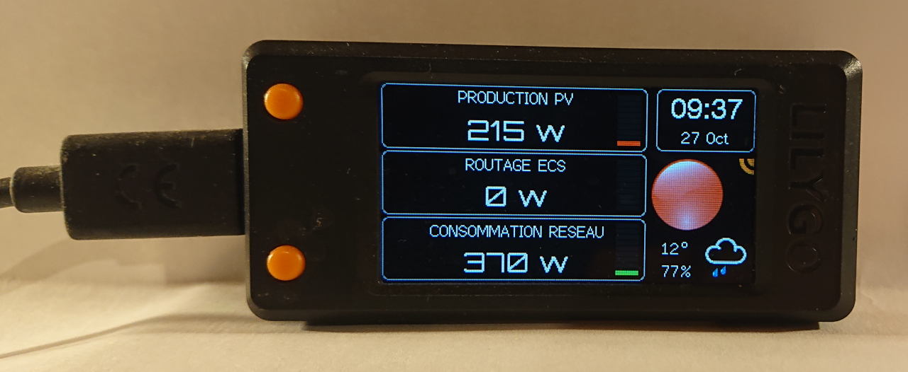
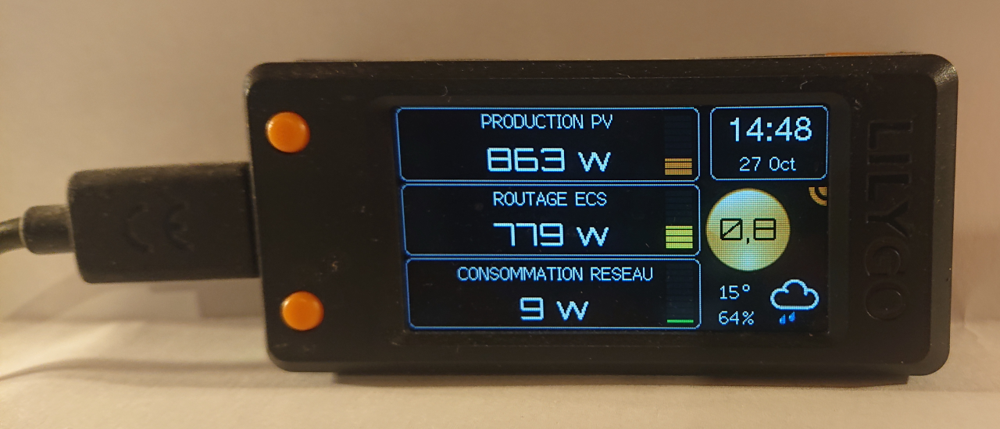

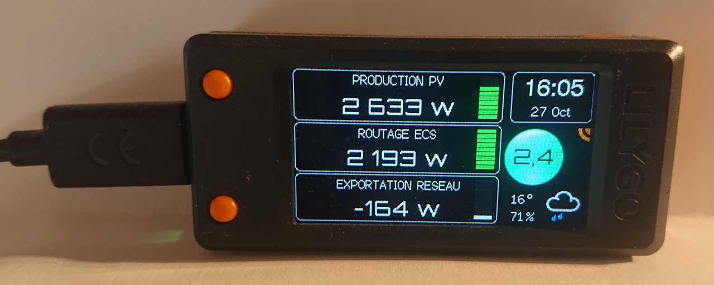
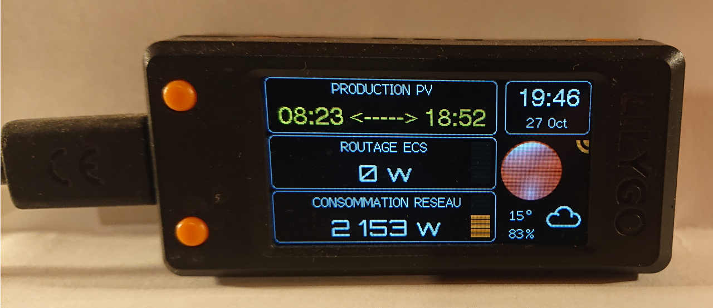

## Ecran réserve d'énergie
L'écran dédié pour la réserve d'énergie permet d'améliorer la lisibilité de l'afficheur quand on est positionné plus loin. Et que l'on veut lancer des appareils en fonction de l'énergie disponible.

Le même code couleur que précédemment est utilisé. 

En situation de production PV, une couleur supplémentaire "blanche" indique la quantité d'énergie injectée sur le réseau.

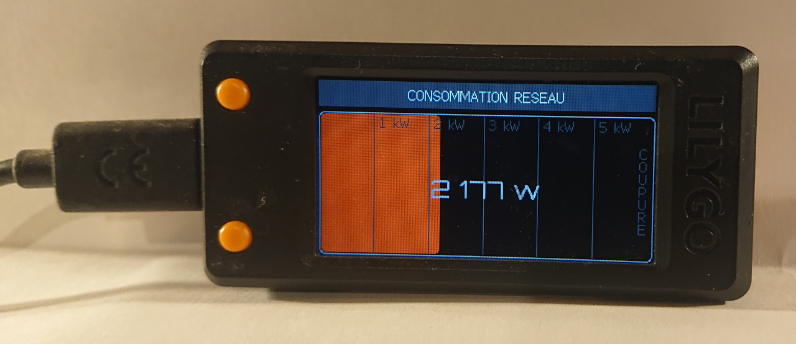

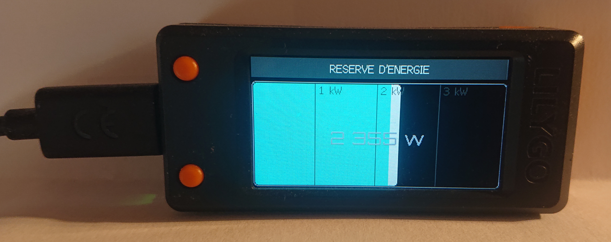

## Ecran index journaliers

Affiche les totaux quotidiens des indicateurs principaux de MaxPV. Bien sûr, les valeurs augmentent au cours de la journée, et repassent à zéro au changement de journée. La bascule est gérée par MaxPV!

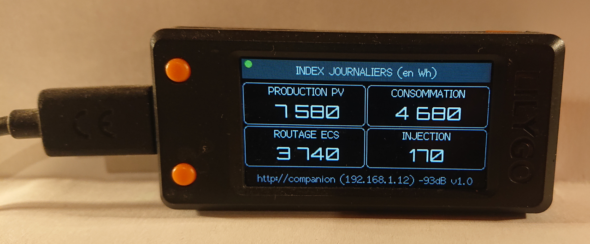

## Les boutons de commande

Le bouton orange supérieur gauche permet d'ajuster la luminosité. Appuyer plusieurs fois sur ce bouton pour modifier la valeur de la luminosité. L'écran est masqué automatique lors du rafraichissement des données.

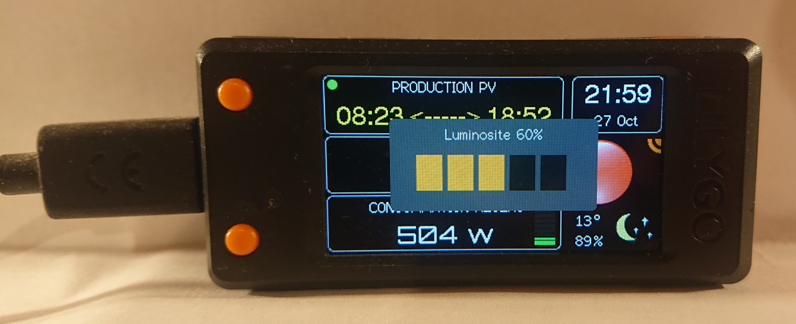

Le bouton orange inférieur gauche permet de changer d'écran. Un double clic permet de revenir directement au premier écran, sans faire défiler les suivants.

Le bouton `Reset` placé sur le dessus de la carte permet de le redémarrer. Sinon, vous pouvez aussi débrancher/rebrancher l'alimentation.

## Interface Web

Une adresse locale permet également d'accéder à une interface Web : http://companion affichant les données principales.

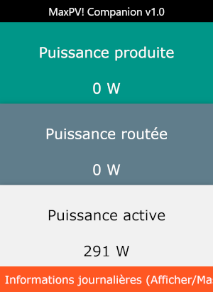

# Crédits

L'afficheur est basé sur les travaux de `Companion MSunPV 2.50` de @jjhontebeyrie (https://github.com/JJHontebeyrie/Companion).

Le code a été adpaté aux spécificités de MaxPV!

# Matériel LiLyGO T-Display-S3
Testé avec cette carte ESP32-S3 en USB-C et avec le boitier plastique (Shell Black) : https://fr.aliexpress.com/item/1005004496543314.html?spm=a2g0o.order_list.order_list_main.82.65435e5bYQbfne&gatewayAdapt=glo2fra

Mais d'autres cartes de votre choix avec les mêmes spécifications seront également adaptées.

En avril 2023, le tout était vendu à 22€.
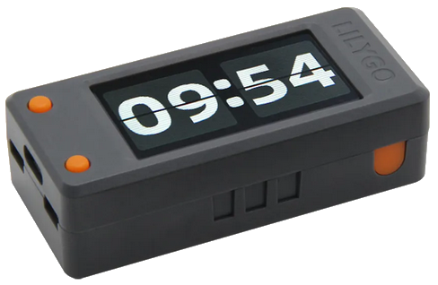

# Versions

## Version 1.0 (27/10/2023)
- Ajout double clic sur bouton droit pour revenir à l'écran principal,
- Amélioration lecture balise de fin pour les données du serveur de température,
- Affichage de la température de l'ECS limité à une décimale,
- Inversion position de la température extérieure et du taux d'humidité.

## Version 0.10 (10/05/2023)
- Correction de l'affichage du niveau de batterie
- Le voyant représente une réserve d'énergie :
	- si importation, alors rouge
	- si réserve jusqu'à 200w, alors orange
	- si réserve jusqu'à 1000w, alors jaune
	- si réserve jusqu'à 2000w, alors vert
	- si plus, alors turquoise
	- en fonction de chaque statut, si exportation d'énergie alors un logo supplémentaire apparait sur le voyant
- Affichage de la valeur de la réserve sur le voyant en kW
- Modification du mode de défilement des écrans par l'appui du bouton bas (Suppression du retour automatique vers l'écran principal)
- Ajout écran "Réserve d'énergie" / "Consommation" : l'objectif est de pouvoir visualiser de loin l'énergie disponible, ou la consommation actuelle
- Augmentation du timeout avant reboot à 20s

## Version 0.9 (03/05/2023)
- Basée sur la version 2.50 de Companion "MSunPV" https://github.com/JJHontebeyrie/Companion

- Adaptation pour la lecture des données de puissance de MaxPV et de quelques paramètres
- Ajout possibilité d'accéder à la température de l'ECS via une API autre que MaxPV (testé avec Jeedom et Shelly 1P)
- Refonte écran de démarrage pour MaxPV!
	- Nouveau logo
	- Indications de connexion avec compte à rebours avant redémarrage auto
- Mise à jour écran principal :
	- Réactualisation des icônes
	- Ajout taux d'humidité
	- Amélioration lisibilité qualité du signal WiFi
	- Suppression de l'indicateur de luminosité
	- Ajout indicateur de rafraichissement des données (en haut à gauche)
	- Amélioration finesse des jauges
	- Jauge d'injection : affichage du taux injecté par rapport à la production courante
- Ecran en surimpression, dédié à la gestion de la luminosité
- Refonte indicateur des cumuls journaliers
	- Ajout d'information techniques (IP + force signal + version)
	- Ajout séparateur de milliers pour meilleure lisibilité

